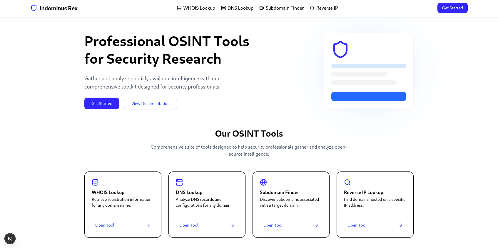
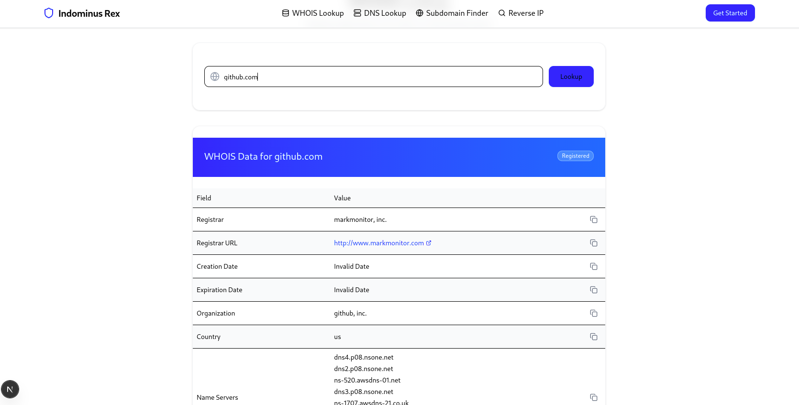
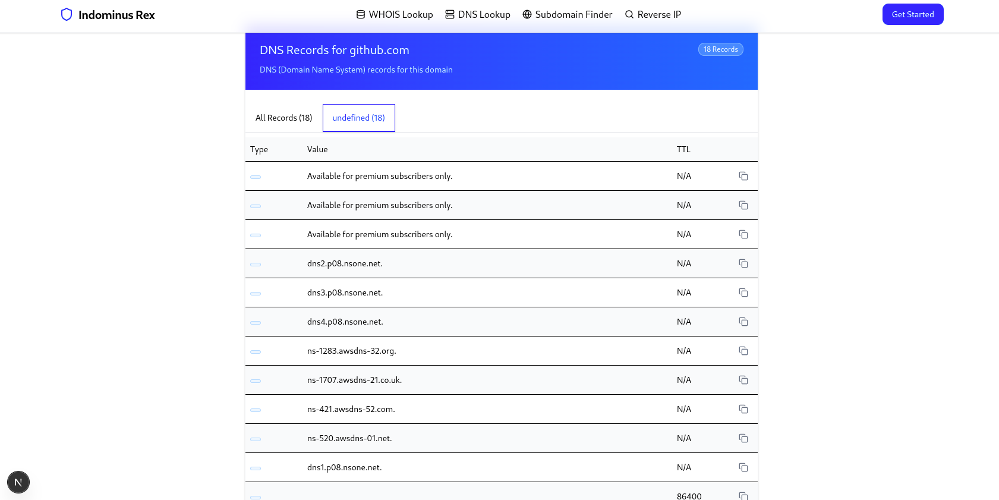

#  OSINT Web Application

## 🌐 Overview
This is an open-source **OSINT (Open Source Intelligence) Web Application** built with **Next.js, TypeScript, Tailwind CSS, ShadCN, and Atercenity UI**. It provides essential intelligence-gathering tools such as WHOIS Lookup, DNS Lookup, Subdomain Finder, and Reverse IP Lookup.

## 🚀 Features
- 🔍 WHOIS Lookup
- 🌐 DNS Lookup
- 🕵️‍♂️ Subdomain Finder
- 🔄 Reverse IP Lookup
- ⚡ Modern UI with **ShadCN**
- 🔐 Secure API Integrations

## 📸 Screenshots




## 📖 Documentation
### 📌 Installation
```sh
git clone https://github.com/your-username/osint-web-app.git
cd osint-web-app
npm install
```

### 🔧 Configuration
Create a `.env` file and set the required API keys:
```sh
NINJA_API_KEY=your_api_key_here
```

### 🏃 Running the Application
```sh
npm run dev
```
Then, open `http://localhost:3000` in your browser.

## 📜 Usage Policy
This tool is intended for **educational and legal research purposes only**. **Misuse of this application for illegal activities is strictly prohibited.** The developers are not responsible for any unauthorized use.

## 🤝 Contributing
We welcome contributions! Fork the repo and create a PR.

## 🛡 License
This project is licensed under the **MIT License**.

---
🌟 **Star this repository** if you find it useful! 🚀
